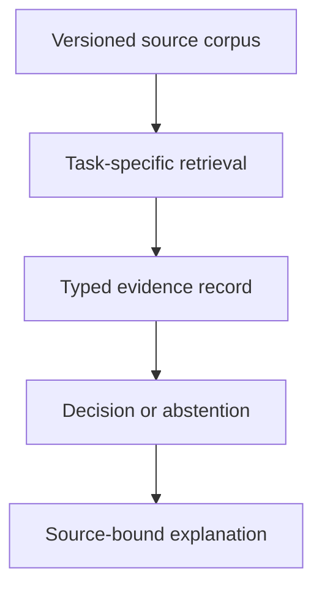

# Retrieved context is evidence, not training

This note answers [issue #58](https://github.com/isomorphisms/ai-ci/issues/58).
It sets the architecture and evidence standard for claims that repositories such
as ASE or Blackball improve answers produced by a language model.

## Decision

A repository is external evidence infrastructure until an evaluation shows a
causal improvement in the decisions made with it. Retrieval success, copied
facts, citations, longer answers, and vocabulary overlap do not establish that
the evidence changed the model's inference.

Use the mechanisms for different jobs:

- retrieval supplies current, private, source-bound, or case-specific evidence;
- supervised or preference training teaches a recurring evidence-handling
  procedure or response policy;
- a constrained intermediate representation and executable rules enforce
  distinctions that must not be left to prose generation;
- the language model explains the resulting evidence and decision, and may
  propose structured entries, but does not certify its own reasoning.

Do not begin a large generic RAG benchmark for ASE or Blackball. Begin with a
small set of counterfactual cases for which the repository evidence has a
declared, decision-relevant consequence. Separate retrieval failure from
evidence-use failure, and compare raw context with a structured evidence path.

## What the BME incident establishes

The experiment summarized in issue #58 asked essentially the same
biomedical-engineering-major question with and without curated context. The
context-assisted answer acquired details such as BLS pay, ABET, debt, placement
rates, and internships, but retained the same broad recommendation: BME can fit
a specifically biomedical goal, while ME, EE, CS, or CE usually provides
broader undergraduate employment options.

This is evidence against the assumed success criterion. It shows that a model
can visibly absorb repository material while preserving its default answer
template. Therefore none of the following is an acceptable proxy for improved
reasoning:

- a retrieved passage entered the context window;
- a repository fact, phrase, or citation appeared in the answer;
- the answer became longer, more detailed, or more confident;
- an embedding or model grader found greater similarity to the source packet.

The incident does **not** establish that retrieval never helps, or even that the
substantive BME conclusion was wrong. The preserved issue does not contain the
exact prompts, raw responses, model snapshot, sampling configuration, or a
predeclared fact that logically required a changed recommendation. The result
therefore diagnoses a methodological assumption, not a general treatment
effect. Future incident records must preserve those inputs before they become
reproducible evaluation cases.

## What happens when context is supplied

### Parameter knowledge is a behavior, not a separate database

Pretraining adjusts model parameters to predict tokens across a large training
distribution. The resulting model can reproduce facts, associations, answer
forms, and common recommendations, but these are not stored as a clean set of
claims with source, date, scope, and confidence fields. "Pretrained prior" or
"parametric memory" is useful shorthand for the model's behavior without the
new evidence; it should not be mistaken for an inspectable knowledge base.

At ordinary inference time the weights remain fixed. Prompt tokens alter the
activations from which the next-token distribution is computed. In-context
"learning" can make the same frozen model continue a demonstrated pattern, but
it does not persistently update the model. Brown et al. explicitly describe
their GPT-3 few-shot curves as using demonstrations without gradient updates.

Retrieved text enters through this same conditioning path. A transformer has
learned patterns for attending to instructions, questions, examples, quoted
documents, and its own generated prefix; it does not contain a guaranteed
epistemic rule saying that a repository passage overrides a familiar answer.
The output can reflect some contextual facts and some parameter-borne
associations at the same time. A fluent blend is not proof that the sources were
treated as premises.

This description is deliberately limited. The exact training data, routing,
tool use, and internal implementation of a hosted model may be undisclosed. The
observable claim needed here is narrower: adding text to one request changes
the conditional computation for that request; it does not by itself train a
stable evidence-use policy.

### Context use is conditional and non-monotone

Controlled studies support four points that matter for the repository design:

1. **Prior and context can conflict.** Longpre et al. found generative QA models
   over-relying on memorized answers when passages supplied conflicting answers.
   Xie et al. later found both receptiveness to coherent external evidence and
   confirmation bias when a context mixed prior-consistent material with a
   conflicting conclusion. "The fact was present" does not determine which
   source controls the output.
2. **Position matters.** Liu et al. found that relevant information in long
   contexts was often used less successfully in the middle than at the
   beginning or end. A nominal context-window size is not an evidence-use
   guarantee.
3. **More retrieval can hurt.** Yoran et al. documented cases where irrelevant
   retrieved passages reduced QA accuracy, especially in multi-hop settings.
   Their mitigation included fine-tuning on mixtures of relevant and irrelevant
   contexts: a learned handling procedure, not merely more retrieval.
4. **Retrieval and reading fail separately.** Joren et al. classified whether
   retrieved context was sufficient to answer a question. Their results varied
   by model family: some systems often answered incorrectly rather than abstain
   when context was insufficient, while others still failed despite sufficient
   context. End-to-end accuracy alone cannot identify which boundary failed.

These results do not yield one universal context-versus-prior law. They show why
ASE and Blackball must measure the interaction for their own tasks rather than
assuming that density, repetition, or a stronger retrieval score will force the
right conclusion.

## Where retrieval ends and adaptation begins

The word "RAG" is often used for several different systems. The original RAG
work by Lewis et al. combined parametric and non-parametric memory and fine-tuned
the model for knowledge-intensive tasks. A frozen hosted model with passages
prepended to a prompt is a useful architecture, but it is more precisely
retrieval-augmented prompting. Its generator has not necessarily been trained
on this repository, its document structure, or its desired decision procedure.

| Mechanism | What changes | Persistence | Appropriate job | What it does not guarantee |
| --- | --- | --- | --- | --- |
| Pretraining or continued pretraining | Model parameters through token-prediction training | Across requests | Broad language and domain regularities | Source provenance, easy factual updates, or compliance with a decision rule |
| In-context examples or supplied documents | Activations for one request | Request only | New facts, demonstrations, temporary constraints | Stable learning, robust context priority, or generalization outside the demonstrated pattern |
| Retrieval-augmented prompting | Which external passages condition a request | Corpus and index persist; model behavior does not | Current or private facts, quotations, provenance, and narrowing a large corpus | That retrieval is sufficient, that the model uses it correctly, or that the answer changes when it should |
| Supervised fine-tuning | Model parameters from labeled input/output examples | Across requests | Repeated task procedure, schema use, domain distinctions, and examples of evidence-sensitive answers | Truth, source freshness, or behavior outside the training distribution |
| Preference tuning or reinforcement learning from feedback | Model parameters toward preferred outputs or outcomes | Across requests | Response policy, abstention incentives, tool policy, and trade-offs represented by the reward | Reliable factual storage or a valid reasoning procedure when the reward is only stylistic or proxy-based |
| Retrieval-aware training, such as RAFT or Self-RAG | Model parameters using retrieval decisions, relevant documents, distractors, citations, or critique signals | Across requests, while evidence remains external | Learning how and when to retrieve, reject distractors, cite, and answer from an open book | Transfer to ASE or Blackball without domain holdouts and adverse-context tests |
| Constrained representation plus executable decision logic | The allowed states and transitions outside the language model | Deterministic for a versioned rule set | Units, applicability, evidence relations, case distinctions, calculations, and mandatory abstention | Correct extraction from prose unless extraction is separately checked |

The practical boundary is purpose, not branding. Use retrieval to make evidence
available and updateable. Use training when the missing capability is a
repeated behavior such as distinguishing evidence from distractors or producing
a complete diagnostic record. Use a constrained representation when an
invariant must hold even if the model would prefer a familiar narrative.

Training is not a substitute for the corpus. Ovadia et al. found RAG stronger
than unsupervised fine-tuning for injecting factual knowledge in their tested
knowledge-intensive tasks. Conversely, retrieval is not a substitute for
learning an evidence-handling policy: RAFT and Self-RAG improve retrieval use by
training for it. The architectural question must be stated as "which component
is missing?" rather than "RAG or training?"

## Architecture for ASE and Blackball

Each boundary must produce a separate receipt. A later success cannot erase an
earlier failure.

### 1. Versioned source corpus

Keep canonical documents, editions, dates, provenance, license information,
and corrections independently useful to people and programs. The corpus is
valuable if it improves source discovery and auditability even before any claim
about model reasoning is justified.

Blackball should remain a model-independent evidence corpus with an
argument-aware retrieval layer and evaluation suite. Personal or learner state
belongs in a separate private layer. ASE likewise needs source identity and
applicability boundaries, not an undifferentiated bin of automotive text.

### 2. Task-specific retrieval

Retrieval returns candidate evidence, not a verdict. Preserve the query or
query decomposition, corpus revision, retrieved passage identifiers, scores,
and filters. Evaluate whether the returned set is sufficient for the declared
question, not merely whether it is topically similar.

Separate an oracle packet, selected by a domain-competent reviewer, from the
actual retriever's packet. If the model succeeds with the oracle packet but not
actual retrieval, improve indexing, chunking, metadata, query construction, or
reranking. If it fails with the oracle packet, adding more documents is not the
first remedy.

### 3. Typed evidence record

Compile the retrieved passages into a constrained, inspectable record before an
open-ended recommendation. The record is not hidden chain of thought. It is the
public evidence state required to justify the decision.

For ASE, useful initial fields include:

- reported symptom and exact operating condition;
- observed measurement, unit, test point, tool, and tolerance;
- candidate fault or system state;
- evidence supporting, opposing, or not discriminating that candidate;
- source passage and applicability conditions;
- proposed next test, expected outcomes, and which candidates each outcome
  separates;
- missing evidence and stop conditions.

For Blackball, useful initial fields include:

- precise claim and scope;
- source, edition or record identity, date, and passage;
- relation: supports, contradicts, qualifies, or only provides background;
- direct observation, primary-source assertion, scholarly interpretation, or
  repository inference;
- competing interpretation and unresolved conflict;
- verified citation edge versus merely topical relation.

Validators can reject missing units, unsupported claims, invalid dates, broken
source links, or a conclusion whose required fields are absent. A model can
propose the record, but an independent check must bind every decisive field to
the cited passage. Attribution is necessary for auditability; as the AIS
framework emphasizes, external-world claims should be verifiable against an
identified source. Attribution alone still does not prove that the conclusion
is good.

### 4. Decision or abstention

Use an executable decision table, calculation, probabilistic model, or explicit
rubric where the domain permits one. Where judgment cannot be made mechanical,
the model must consume the typed record, expose the decisive evidence fields,
preserve conflicts, and return `missing_evidence` when the record is
insufficient. Do not allow an unrestricted prose answer to silently bypass the
record.

For ASE, "more discriminating" means that evidence changes the candidate fault
set, rules out an otherwise plausible cause, changes the next test, or changes
the stop/repair decision. For Blackball, it means that evidence changes a
claim's support status, scope, competing explanations, or uncertainty. A new
name, quotation, or citation attached to the same unsupported inference is not
an improvement.

### 5. Source-bound explanation

Generate prose after the evidence and decision states are recorded. The
explanation should state what changed relative to the baseline, identify the
decisive evidence, distinguish observation from inference, and preserve
uncertainty. It cannot grant itself a pass.

## Evidence required to claim improved downstream reasoning

### State the claim level

Do not slide from one level to another:

1. **Corpus value:** people or programs can find and verify better sources.
2. **Retrieval value:** actual retrieval supplies sufficient task evidence more
   often than the comparison system.
3. **Inference value:** given sufficient evidence, the system makes better
   decisions than the same model without the repository.
4. **Operational value:** those decisions improve real outcomes, cost, time, or
   avoidable error.

Evidence for level 1 does not establish level 3. ASE or Blackball may be worth
building at level 1 while higher-level claims remain open.

### Use diagnostic comparison arms

For each case, compare at least these conditions with the same question and
declared model configuration:

| Arm | Evidence path | What the comparison identifies |
| --- | --- | --- |
| A | No repository evidence | Pretrained/default behavior |
| B | Actual repository retrieval in raw context | End-to-end repository effect: B versus A |
| C | Reviewer-selected sufficient repository packet | Retrieval gap: C versus B; generator's best available raw-context use: C versus A |
| D | Sufficient packet compiled into the typed record and constrained decision path | Value of representation/control: D versus C |
| E | Retrieval-aware trained model, if later built | Added value and new failure modes of training: E versus the same evidence path without it |

Keep the model, prompt obligations, sampling settings, and relevant token budget
fixed where possible. Record provider model snapshot and every retrieved
passage. Run enough independent trials to estimate instability, but do not
multiply trials before the case has a valid decision oracle.

### Design evidence interventions, not topical prompts

Each important case belongs to a counterfactual family with a predeclared
expected response:

- **Decision-changing twin:** change one source-backed fact across a real
  diagnostic or historical boundary; the diagnosis, ranking, next test, claim
  scope, or uncertainty must change in the specified direction.
- **Removal:** remove the decisive passage; the system must abstain, lower
  confidence, or choose the declared alternative rather than preserve the same
  answer with fewer citations.
- **Irrelevant and duplicate controls:** add topical distractors, duplicates,
  or repository vocabulary; the substantive decision must remain invariant.
- **Conflict:** introduce a credible contrary source, stale source, or
  prior-consistent distractor; the record must expose the conflict and apply a
  declared source/applicability rule rather than blend it away.
- **Position and wording:** move decisive evidence and paraphrase the question;
  the justified decision must remain stable.
- **Insufficient evidence:** withhold a required observation or source; the
  system must return the declared missing field instead of a generic answer.

The oracle must specify the substantive effect before candidate outputs are
seen. Cases whose curated material only reinforces the expected baseline can
test attribution or stability, but they cannot demonstrate that the repository
redirects reasoning.

### Measure decisions separately from attribution

Report at least:

- correctness or domain-specific decision loss;
- discrimination between cases the baseline conflates;
- correctness and expected value of the next test or research step;
- calibration, selective risk, and correct abstention;
- completeness and validity of decisive source support;
- warranted sensitivity to decision-changing evidence;
- invariance to irrelevant, duplicated, repositioned, and stylistically altered
  context;
- retrieval sufficiency and evidence-use accuracy as separate quantities.

Do not average a dangerous failure away with easy factual questions. Report by
case family and make required invariants conjunctive. Use blinded domain review
where no mechanical oracle exists; a model grader may assist with narrow source
entailment but cannot be the sole judge of the architecture that produced the
answer.

### Concrete acceptance bars

ASE may claim an inference improvement only when, on protected incident-derived
and expert-authored case families, the repository-backed system reliably does
one or more of the following without regressing the controls:

- separates diagnoses that the no-repository model conflates;
- rules out a documented tempting error;
- selects a safer or more informative next test;
- avoids an unnecessary part replacement or unsafe action;
- abstains when a required measurement or applicability fact is absent.

Blackball may claim an inference improvement only when the system reliably:

- changes a claim, scope, or uncertainty when decisive source evidence changes;
- keeps disputed evidence and competing interpretations distinct;
- follows verified citation edges without promoting topical neighbors to
  support;
- distinguishes the event under study from later violence, intervention, or
  retrospective interpretation when the sources require that separation;
- refuses a synthesis whose required primary or scholarly evidence is absent.

For either repository, the effect must survive protected paraphrases and
multiple trials, be bound to exact corpus and model revisions, and be reported
with the failures. A material gain in actual-retrieval arm B over arm A is the
minimum evidence for an end-to-end claim. Arm C establishes whether retrieval
is the bottleneck; arm D establishes whether constrained representation adds
value. One favorable example, citation frequency, or mean lexical score is not
enough.

## Build order

1. Preserve the BME incident as a warning, not as a quantitative benchmark.
2. Define ten to twenty decision-boundary families for ASE and Blackball, with
   small protected variants and domain-competent oracles.
3. Run arms A through D before selecting a training method.
4. If C succeeds and B fails, repair retrieval.
5. If C fails but D succeeds, make the typed representation and constrained
   decision path architectural, not optional prompt wording.
6. If the same evidence-use failure recurs across well-formed records, collect
   labeled examples and test retrieval-aware supervised or preference training.
7. Keep facts and provenance in the repository even if a trained model is used;
   retraining is not the update or audit path.
8. Do not deploy a safety-relevant recommendation path whose required
   distinction remains unreliable. Preserve the corpus as human-usable
   infrastructure and return the evidence record instead.

This is a mechanism-led program rather than "test to oblivion." Every case must
identify which boundary can fail and what outcome would change the architecture.

## Primary sources

- Brown et al., [*Language Models are Few-Shot
  Learners*](https://arxiv.org/abs/2005.14165) (2020): in-context task
  conditioning without gradient updates.
- Lewis et al., [*Retrieval-Augmented Generation for Knowledge-Intensive NLP
  Tasks*](https://arxiv.org/abs/2005.11401) (2020): the original trainable
  parametric/non-parametric RAG formulation.
- Longpre et al., [*Entity-Based Knowledge Conflicts in Question
  Answering*](https://aclanthology.org/2021.emnlp-main.565/) (2021): controlled
  conflict between supplied passages and memorized answers.
- Ouyang et al., [*Training Language Models to Follow Instructions with Human
  Feedback*](https://arxiv.org/abs/2203.02155) (2022): supervised instruction
  tuning followed by preference-based reinforcement learning.
- Liu et al., [*Lost in the Middle: How Language Models Use Long
  Contexts*](https://aclanthology.org/2024.tacl-1.9/) (2024): position-sensitive
  use of relevant long-context information.
- Xie et al., [*Adaptive Chameleon or Stubborn Sloth: Revealing the Behavior of
  Large Language Models in Knowledge
  Conflicts*](https://openreview.net/forum?id=auKAUJZMO6) (ICLR 2024):
  receptiveness and confirmation bias under controlled external evidence.
- Yoran et al., [*Making Retrieval-Augmented Language Models Robust to
  Irrelevant Context*](https://openreview.net/forum?id=ZS4m74kZpH) (ICLR 2024):
  harms from irrelevant retrieval and retrieval-aware fine-tuning.
- Asai et al., [*Self-RAG: Learning to Retrieve, Generate, and Critique through
  Self-Reflection*](https://arxiv.org/abs/2310.11511) (ICLR 2024): trained
  retrieval, relevance, support, and critique behavior.
- Zhang et al., [*RAFT: Adapting Language Model to Domain Specific
  RAG*](https://arxiv.org/abs/2403.10131) (2024): supervised open-book training
  with oracle documents, distractors, evidence quotation, and answers.
- Ovadia et al., [*Fine-Tuning or Retrieval? Comparing Knowledge Injection in
  LLMs*](https://arxiv.org/abs/2312.05934) (2023): an empirical comparison in
  which RAG outperformed unsupervised fine-tuning for tested factual knowledge.
- Rashkin et al., [*Measuring Attribution in Natural Language Generation
  Models*](https://aclanthology.org/2023.cl-4.2/) (2023): Attributable to
  Identified Sources as a source-verifiability criterion.
- Joren et al., [*Sufficient Context: A New Lens on Retrieval Augmented
  Generation Systems*](https://arxiv.org/abs/2411.06037) (ICLR 2025): separate
  evaluation of context sufficiency, context use, and abstention.
